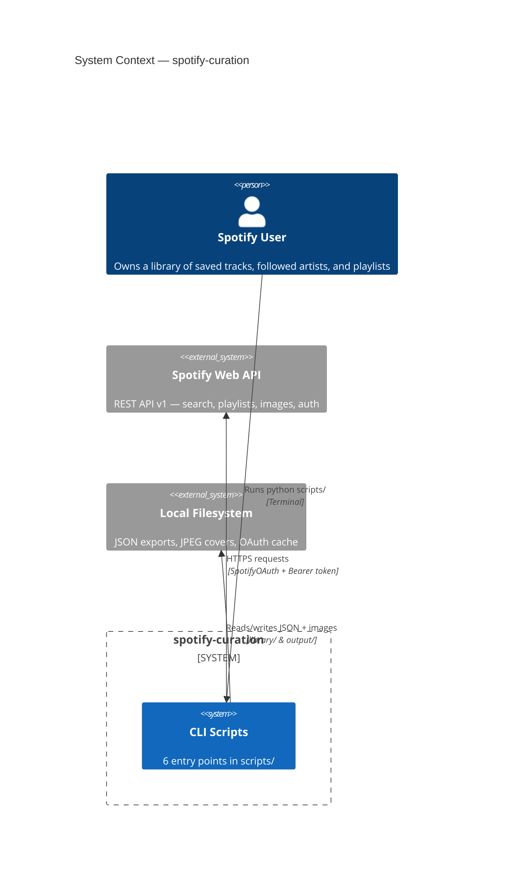
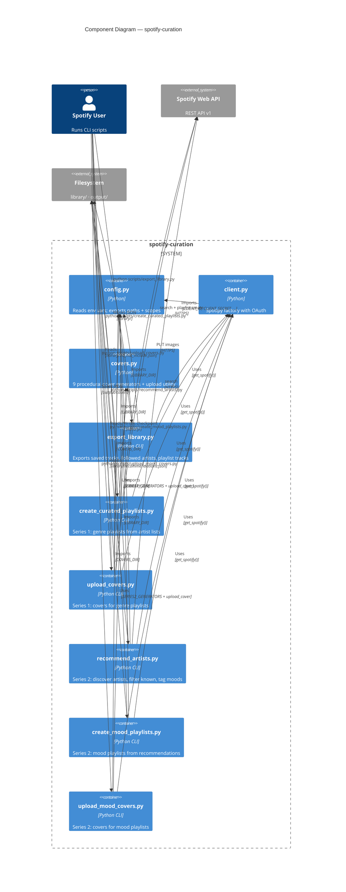
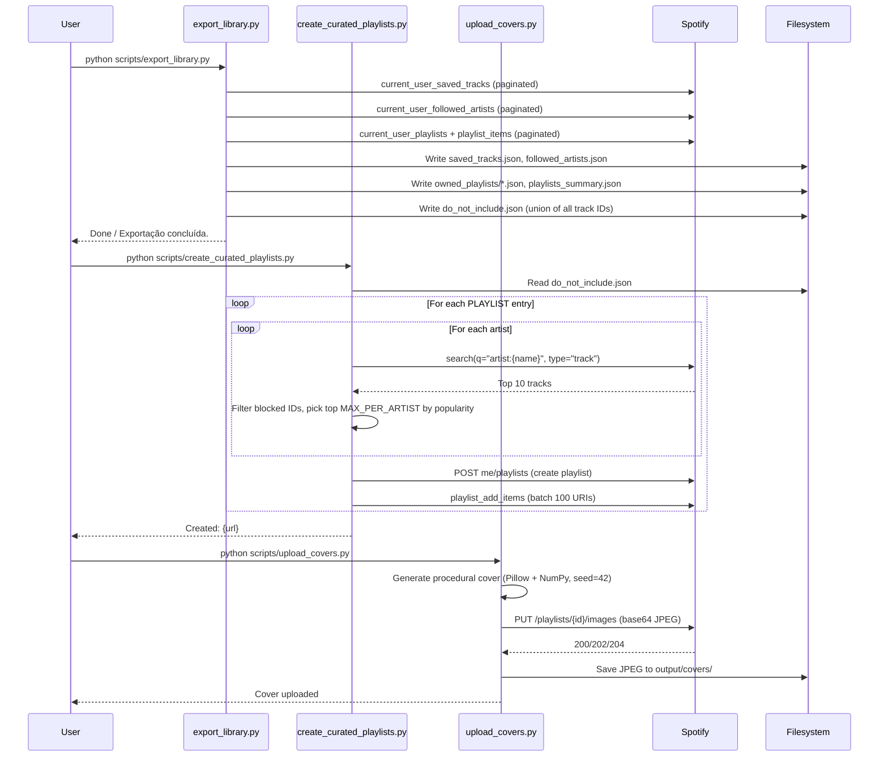
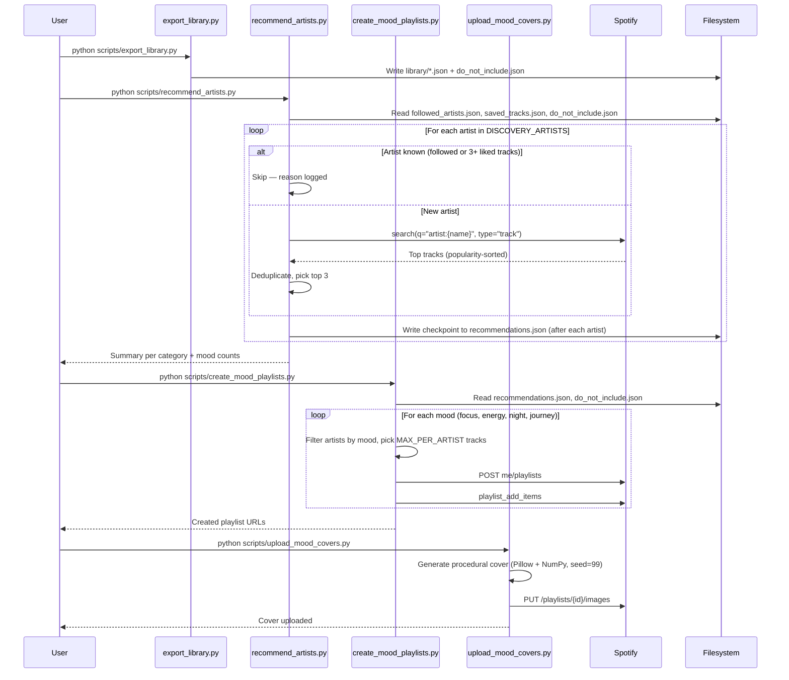
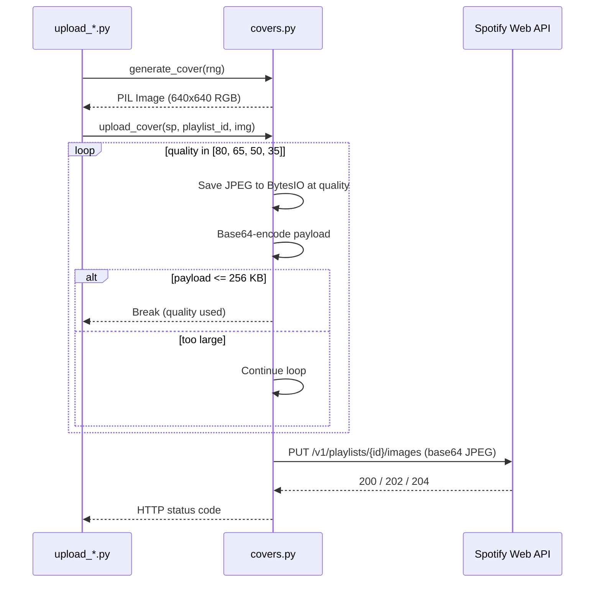

# Architecture — spotify-curation

> **Language:** English (primary) | Portuguese (supplementary)

---

## 1. Introduction and Goals

### 1.1. Problem Statement

Spotify's algorithm optimises for engagement, not discovery. The user's existing library is never used as a hard filter — tracks the user already owns reappear in recommendations, and the "discovery" surface is controlled by a black box.

### 1.2. Solution

**spotify-curation** is a CLI tool that puts the user in full control of playlist creation:

1. **Export** the complete Spotify library (saved tracks, followed artists, owned playlists).
2. **Block** every known track ID so it never appears again.
3. **Curate** playlists from user-defined artist lists (two series: genre-based and mood-based).
4. **Beautify** playlists with procedurally generated cover art (Pillow + NumPy).

### 1.3. Quality Goals

| Goal | Description |
|------|-------------|
| Reproducibility | Cover generation uses fixed random seed — identical output across runs |
| Transparency | No ML, no opaque recommendations; every track selection is traceable to a user-defined artist |
| Offline-first | Library export produces static JSON files — curation logic works without live API access |
| Minimal dependencies | Only spotipy, Pillow, NumPy, requests, python-dotenv |

### 1.4. Portuguese — Objetivos

Ferramenta CLI para criação de playlists personalizadas no Spotify. O usuário define listas de artistas, a ferramenta exporta a biblioteca, bloqueia faixas já conhecidas e cria playlists com capas procedurais.

---

## 2. Constraints

| Constraint | Impact |
|------------|--------|
| **Spotify Web API rate limits** | All scripts throttle requests with `time.sleep(0.1–0.5)` |
| **Deprecated endpoints (Nov 2024)** | `related-artists`, `top-tracks`, `recommendations` return `403` for most apps. The project uses `search(type=track)` instead |
| **JPEG size limit (256 KB)** | `upload_cover` degrades quality iteratively (80→65→50→35) until the base64 payload fits |
| **Python 3.8+** | `ruff.toml` targets py38; avoids 3.9+ features |
| **OAuth browser popup** | First run requires interactive browser for Spotify authorisation |
| **No test suite** | CONTRIBUTING.md explicitly states this — manual verification against a real account is the current standard |

---

## 3. Context and Scope

### 3.1. C4 Level 1 — System Context Diagram



### 3.2. Scope

**In scope:**
- Export library to JSON (saved tracks, followed artists, owned playlists)
- Block known tracks via `do_not_include.json`
- Create genre-based playlists from user-defined artist lists (Series 1)
- Discover artists by category + mood tag (Series 2)
- Create mood-based playlists (Series 2)
- Generate procedural JPEG covers and upload via Spotify API
- Portuguese/English bilingual README

**Out of scope:**
- Real-time sync or webhook subscriptions (no persistent server)
- Collaborative playlist management
- Spotify playback control
- Machine learning or recommendation engine
- Mobile or web UI

---

## 4. Solution Strategy

### 4.1. Architectural Style

**Pipeline architecture** with two independent series that share a common foundation:

```
                    ┌──────────────────────────────┐
                    │       Shared Foundation        │
                    │  config.py · client.py         │
                    │  covers.py · .env              │
                    └──────────┬───────────────────┘
                               │
              ┌────────────────┼────────────────┐
              │                                 │
    ┌─────────▼──────────┐        ┌─────────────▼──────────┐
    │   Series 1          │        │   Series 2              │
    │   Genre-based       │        │   Mood-based            │
    │                     │        │                         │
    │   export_library.py │        │   export_library.py     │
    │         ↓           │        │         ↓               │
    │ create_curated_     │        │ recommend_artists.py    │
    │   playlists.py      │        │         ↓               │
    │         ↓           │        │ create_mood_            │
    │ upload_covers.py    │        │   playlists.py          │
    │                     │        │         ↓               │
    └─────────────────────┘        │ upload_mood_covers.py   │
                                   └─────────────────────────┘
```

### 4.2. Key Decisions

| Decision | Rationale |
|----------|-----------|
| JSON files as state (no database) | Keeps dependencies minimal; files are human-readable and debuggable; checkpoints enable resume on interrupt |
| Fixed-seed NumPy RNG | Cover art is deterministic and reproducible across runs |
| `search(type=track)` over deprecated endpoints | Available to all Spotify apps without Extended Quota Mode |
| Module-level `sys.path.insert(0, ...)` in scripts | Avoids packaging overhead; scripts run directly with `python scripts/foo.py` |
| `ruff.toml` over `pyproject.toml` | Keeps config minimal; no packaging metadata needed in a script-based project |

---

## 5. Building Block View

### 5.1. C4 Level 2 — Component Diagram



### 5.2. Module Overview

| Module | Responsibility | Key Exports |
|--------|---------------|-------------|
| `config.py` | Environment-based configuration | `CLIENT_ID`, `CLIENT_SECRET`, `REDIRECT_URI`, `SCOPES`, `LIBRARY_DIR`, `COVERS_DIR` |
| `spotify_curation/client.py` | Spotify OAuth client factory | `get_spotify(show_dialog=False)` |
| `spotify_curation/covers.py` | Procedural cover art + upload | `SERIES1_GENERATORS`, `SERIES2_GENERATORS`, `upload_cover()`, `lerp_color()`, `gradient_bg()` |
| `scripts/export_library.py` | Full library export | `main()` → JSON files in `library/` |
| `scripts/create_curated_playlists.py` | Series 1 playlist creation | `main()` → genre playlists |
| `scripts/upload_covers.py` | Series 1 cover upload | `main()` → JPEG + image upload |
| `scripts/recommend_artists.py` | Series 2 artist discovery | `main()` → `recommendations.json` |
| `scripts/create_mood_playlists.py` | Series 2 mood playlists | `main()` → mood playlists |
| `scripts/upload_mood_covers.py` | Series 2 cover upload | `main()` → JPEG + image upload |

---

## 6. Runtime View

### 6.1. Series 1 — Genre Playlist Creation



### 6.2. Series 2 — Mood Playlist Discovery & Creation



### 6.3. Cover Upload — JPEG Size Adaptation



---

## 7. Deployment View

### 7.1. Local Workstation

The tool runs exclusively on the user's local machine. There is no server component.

```
┌─────────────────────────────────────────────────┐
│                  User Workstation                 │
│                                                   │
│  $ python scripts/export_library.py               │
│  $ python scripts/create_curated_playlists.py     │
│                                                   │
│  ┌─────────────────────────────────────────┐      │
│  │  spotify-curation/                       │      │
│  │  ├── scripts/          (6 CLIs)          │      │
│  │  ├── spotify_curation/ (shared lib)      │      │
│  │  ├── config.py                           │      │
│  │  ├── .env              (credentials)     │      │
│  │  ├── library/          (JSON state)      │      │
│  │  ├── output/covers/    (JPEG files)      │      │
│  │  └── requirements.txt                    │      │
│  └─────────────────────────────────────────┘      │
│                                                   │
│  Python 3.8+ with spotipy, Pillow, NumPy           │
└─────────────────────────────────────────────────┘
```

### 7.2. Required Runtime

| Component | Version |
|-----------|---------|
| Python | 3.8+ |
| spotipy | 2.23+ |
| Pillow | 10.0+ |
| NumPy | 1.24+ |
| requests | 2.31+ |
| python-dotenv | 1.0+ |

### 7.3. External Service

| Service | Authentication | Rate Limit Notes |
|---------|---------------|------------------|
| Spotify Web API | OAuth 2.0 (Authorization Code Flow) | ~10 req/s for search; scripts use 150-500ms delays |
| `PUT /playlists/{id}/images` | OAuth token (ugc-image-upload scope) | 256 KB payload limit per image |

---

## 8. Cross-cutting Concepts

### 8.1. Error Handling

- **Spotify API timeouts**: `recommend_artists.py` implements exponential backoff (2^attempt seconds) for timeout errors
- **Missing credentials**: `config.py` raises `KeyError` on missing `SPOTIFY_CLIENT_ID` / `SPOTIFY_CLIENT_SECRET`
- **Incomplete playlists**: Both `create_*_playlists.py` scripts skip creation if fewer than 5 tracks are selected (prints a WARNING)
- **Unconfigured playlists**: Cover upload scripts skip entries whose `id` starts with `<` (placeholder detection)

### 8.2. State Management

All state is stored as JSON files in `library/`:

| File | Produced By | Consumed By | Format |
|------|-------------|-------------|--------|
| `saved_tracks.json` | `export_library.py` | `recommend_artists.py` | Array of track objects |
| `followed_artists.json` | `export_library.py` | `recommend_artists.py` | Array of artist objects |
| `playlists_summary.json` | `export_library.py` | — | Array of playlist summaries |
| `owned_playlists/*.json` | `export_library.py` | — | Per-playlist track dumps |
| `do_not_include.json` | `export_library.py` | All curation scripts | Flat array of track ID strings |
| `recommendations.json` | `recommend_artists.py` | `create_mood_playlists.py` | Array of artist discovery records |

### 8.3. Reproducibility

- Cover generators use `numpy.random.default_rng(42)` (Series 1) and `numpy.random.default_rng(99)` (Series 2) — deterministic output across runs
- No external data sources beyond Spotify API responses; API changes may affect reproducibility

### 8.4. Security

- Credentials read from `.env` file (gitignored) or environment variables
- OAuth token cached in `library/.cache` (gitignored)
- All API communication over HTTPS
- No secrets in code — `config.py` reads from environment only

### 8.5. i18n

- README and CONTRIBUTING are bilingual (English primary, Portuguese supplementary)
- Inline code comments follow the same pattern (`# action / ação`)
- CLI output is English-only for consistency

---

## 9. Design Decisions

### 9.1. ADR-001: JSON files over a database

| Field | Value |
|-------|-------|
| **Context** | The tool needs to persist library state and checkpoint progress |
| **Decision** | Use flat JSON files in `library/` |
| **Rationale** | Zero additional dependencies; files are human-readable for debugging; checkpoint writes after every artist in `recommend_artists.py` enable safe interruption and resume |
| **Consequences** | No query capability; full-file writes are atomic (`open + write`) but not ACID; scales poorly beyond ~10K tracks |
| **Status** | Accepted |

### 9.2. ADR-002: Script-based CLI over packaged tool

| Field | Value |
|-------|-------|
| **Context** | Six entry points need to be run by the user from a terminal |
| **Decision** | Keep scripts as standalone `.py` files with `sys.path.insert(0, ...)` for imports |
| **Rationale** | Simplest possible setup — clone, `pip install -r requirements.txt`, `python scripts/foo.py`. No packaging, no build step, no `setup.py` |
| **Consequences** | Cannot install via `pip install -e .` or publish to PyPI without additional packaging work; `ruff.toml` suppresses `E402` for `scripts/` |
| **Status** | Accepted |

### 9.3. ADR-003: Procedural cover art over downloaded images

| Field | Value |
|-------|-------|
| **Context** | Playlist covers need to be unique and visually consistent per series/syle |
| **Decision** | Generate covers procedurally with Pillow + NumPy using fixed random seeds |
| **Rationale** | No copyright concerns; fully reproducible; no network calls; lightweight (no ML model); each generator encodes a visual metaphor for the genre/mood |
| **Consequences** | 9 unique generators to maintain; visual diversity depends on generator quality rather than asset curation |
| **Status** | Accepted |

### 9.4. ADR-004: `search(type=track)` over deprecated recommendation endpoints

| Field | Value |
|-------|-------|
| **Context** | Three Spotify API endpoints (`related-artists`, `top-tracks`, `recommendations`) were deprecated in November 2024 |
| **Decision** | Use `search(q="artist:{name}", type="track")` and sort by popularity |
| **Rationale** | Works on all API tiers without Extended Quota Mode; the search endpoint is mature and stable |
| **Consequences** | Cannot discover "related" artists automatically — the user must supply artist lists; search results may include remixes or live versions (mitigated by canonical name deduplication) |
| **Status** | Accepted |

---

## 10. Quality Scenarios

### 10.1. Primary Quality Attributes

| Attribute | Scenario | Current Status |
|-----------|----------|----------------|
| **Reproducibility** | Running `upload_covers.py` twice produces identical JPEG files | Guaranteed — fixed NumPy seed |
| **Determinism** | Same artist list + same library → same playlists | Dependent on Spotify API response order (search results may vary) |
| **Resilience** | Interrupt and restart `recommend_artists.py` mid-way | Supported — per-artist checkpoint writes to `recommendations.json` |
| **Correctness** | A track in `do_not_include.json` never appears in a curated playlist | Verified — blocklist is checked at search time and again at playlist creation |
| **Availability** | Spotify API is unavailable | Fail-fast with clear HTTP error — no queuing or retry beyond timeout backoff |

### 10.2. Test Coverage

| Area | Coverage | Notes |
|------|----------|-------|
| Cover generators core (`lerp_color`, `gradient_bg`) | `tests/test_covers.py` | Unit-tested in [`tests/test_covers.py`](tests/test_covers.py) |
| All 9 cover generators | `tests/test_covers.py` | Verify: 640x640 RGB output, no exceptions, reproducibility |
| Import resolution | CI (`ruff check` + import check) | `.github/workflows/ci.yml` |
| CLI entry points | Manual | Requires live Spotify OAuth session |

---

## 11. Risks and Technical Debt

### 11.1. Technical Debt

| Item | Severity | Description |
|------|----------|-------------|
| `sys.path.insert` pattern | Low | Scripts mutate `sys.path` before imports — fragile with conflicting package names |
| No `pyproject.toml` | Low | Cannot `pip install -e .` or declare optional dependency groups |
| No type hints | Medium | `covers.py` has no function signatures; all scripts lack annotations |
| Manual playlist ID copy | Medium | Users must paste playlist IDs from script output into upload scripts — no automated handoff |
| Hardcoded seeds (42, 99) | Low | Cover reproducibility is intentional; no mechanism for custom seeds |
| OAuth token stored in versioned directory | Low | `.cache` lives in `library/` (gitignored) but a misconfigured `.gitignore` could leak tokens |
| Deprecated endpoint reliance removed | Low | Already migrated to `search` — but upstream Spotify API changes are an ongoing risk |

### 11.2. Risks

| Risk | Likelihood | Impact | Mitigation |
|------|-----------|--------|------------|
| Spotify deprecates `search(type=track)` by popularity | Low | High | Monitor Spotify changelog; fall back to `tracks` endpoint by album |
| Extended Quota Mode becomes mandatory for playlist creation | Low | Medium | Document workarounds; provide PR guidance |
| OAuth cache expires mid-run | Medium | Low | Scripts re-prompt browser on `show_dialog=True` |
| Large library exceeds memory | Low | Low | Tracks capped by Spotify pagination (50-100 per page); JSON files are streaming-friendly |

---

## 12. Glossary

| Term | Definition |
|------|-----------|
| **blocklist / do_not_include** | Set of all track IDs the user already owns — used as a hard filter against repeats |
| **Series 1** | Genre-based manual curation: user defines artist lists per playlist |
| **Series 2** | Mood-based automated discovery: user defines categories + mood tags; tool groups tracks by mood |
| **Spotipy** | Python library for the Spotify Web API (`spotipy` package) |
| **OAuth** | Spotify Authorization Code Flow — requires browser interaction on first run |
| **Procedural cover** | Playlist cover image generated algorithmically (Pillow + NumPy) rather than from a static asset |
| **Mood tag** | String label (`focus`, `energy`, `night`, `journey`) assigned to a discovery artist; determines which mood playlist the artist's tracks populate |
| **Checkpoint** | Periodic save of `recommendations.json` after each artist in `recommend_artists.py` — enables safe interruption and resume |
| **Extended Quota Mode** | Spotify's optional API tier that re-enables deprecated endpoints — not required by this project |
| **Canonical name** | Track name with parenthetical suffixes (live, remaster, etc.) stripped for deduplication |
